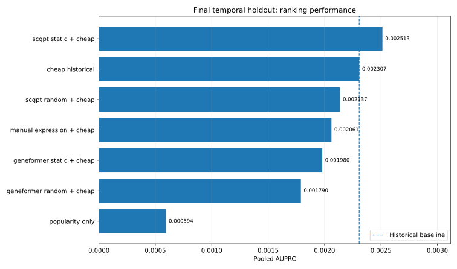
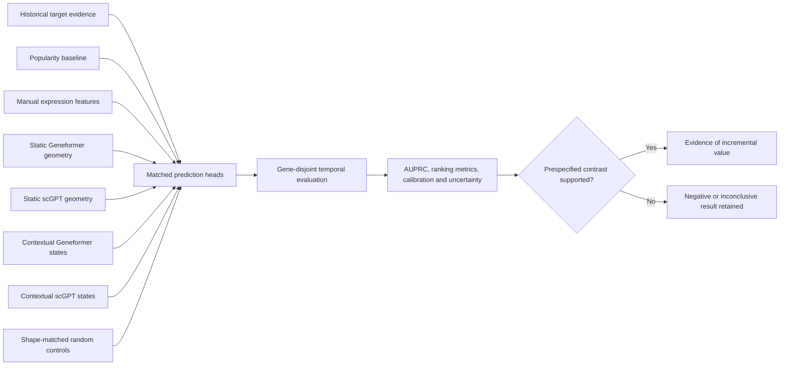
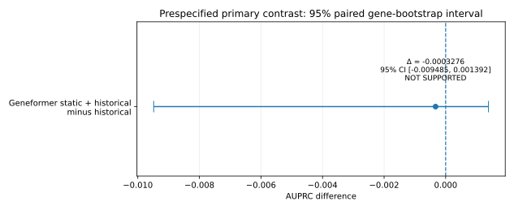
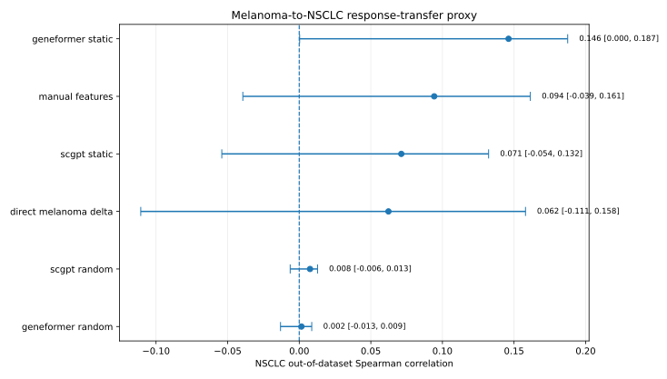
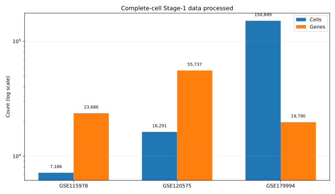

[](RELEASE_NOTES_v0.5.0a1.md)
[](pyproject.toml)
[](VALIDATION.md)
[](VALIDATION.md)
[](LICENSE)
[](#current-status)

# FM Value Audit

**Does a single-cell foundation model add enough information to improve a real target-prioritisation decision?**

FM Value Audit is a leakage-aware benchmarking framework for testing whether representations from models such as **Geneformer** and **scGPT** add measurable value beyond cheaper, easier-to-explain alternatives in immuno-oncology target prioritisation.

The project is intentionally designed to report negative results. A sophisticated embedding is not treated as useful merely because it looks biologically structured: it must improve a prespecified decision metric on unseen future outcomes.

> **Research software only.** FM Value Audit evaluates methods for preclinical target prioritisation. It does not recommend a medicine, diagnose a patient or make a clinical decision.



## Current status

**v0.5.0a1 is a GitHub pre-release and execution alpha.**

It contains two clearly separated evidence layers:

1. **Final v0.4 result:** static Geneformer token geometry did **not** improve the prespecified AUPRC contrast over the historical baseline.
2. **Prospective v0.5 protocol:** contextual cell-state embeddings are preregistered, but the GPU runs and future outcome evaluation are not yet complete.

The release must therefore not be described as evidence that contextual foundation-model representations improve target prioritisation.


<!-- Machine-checked release claims -->
<!-- fmva-claim path="results/temporal_benchmark_v0.4/INTEGRATION_AUDIT.json" jsonpath="status" value="PASS_WITH_WARNINGS" -->
<!-- fmva-claim path="results/temporal_benchmark_v0.4/INTEGRATION_AUDIT.json" jsonpath="summary.holdout_rows" value="79542" -->
<!-- fmva-claim path="results/temporal_benchmark_v0.4/INTEGRATION_AUDIT.json" jsonpath="summary.holdout_positives" value="14" -->
<!-- fmva-claim path="results/temporal_benchmark_v0.4/INTEGRATION_AUDIT.json" jsonpath="summary.primary_conclusion" value="NOT_SUPPORTED" -->
<!-- fmva-claim path="results/temporal_benchmark_v0.4/stage3b/primary_conclusion.json" jsonpath="point_delta" value="-0.00032755486429918244" -->
<!-- fmva-claim path="results/temporal_benchmark_v0.4/stage3b/primary_conclusion.json" jsonpath="ci_lower_2_5" value="-0.009484827468089183" -->
<!-- fmva-claim path="results/temporal_benchmark_v0.4/stage3b/primary_conclusion.json" jsonpath="ci_upper_97_5" value="0.0013916328916157368" -->
<!-- fmva-claim path="results/ood_proxy/ood_proxy_summary.json" jsonpath="geneformer_ood_spearman" value="0.14617330321373126" -->
<!-- fmva-claim path="results/stage1_full_cells/GSE115978_summary.json" jsonpath="cells_retained" value="7186" -->
<!-- fmva-claim path="results/stage1_full_cells/GSE120575_summary.json" jsonpath="cells_retained" value="16291" -->
<!-- fmva-claim path="results/stage1_full_cells/GSE179994_summary.json" jsonpath="cells_retained" value="150849" -->

## The problem

Foundation models can produce impressive high-dimensional embeddings, but several questions are often left unanswered:

- Are the embeddings contextual, or only static token vectors?
- Were test outcomes used indirectly during feature selection or tuning?
- Does the model outperform a cheap historical or expression-based baseline?
- Is the apparent improvement larger than bootstrap uncertainty?
- Does the result transfer across datasets, diseases and experimental settings?
- Are unsuccessful methods still reported?
- Can every claim be traced to a sealed input, hash and frozen configuration?

FM Value Audit turns those questions into explicit software and statistical contracts.

## The idea

The framework compares increasingly complex representations under the same split, target universe and evaluation rules:



The important unit is not embedding quality in isolation. It is **incremental decision value over a realistic comparator**.

## Main result: the static representation hypothesis was not supported

The real temporal benchmark covered:

| Quantity | Value |
|---|---:|
| Candidate genes | 17,527 |
| Solid-tumour indications | 23 |
| Development rows | 321,222 |
| Development positives | 42 |
| Final holdout rows | 79,542 |
| Gene-disjoint holdout genes | 3,476 |
| Final holdout positives | 14 |
| Paired bootstrap replicates | 2,000 |

The confirmatory contrast was frozen before the final holdout was opened:

```text
AUPRC(geneformer_static_plus_cheap) - AUPRC(cheap_historical)
```

| Metric | Result |
|---|---:|
| Geneformer static + historical AUPRC | 0.001980 |
| Historical baseline AUPRC | 0.002307 |
| Paired AUPRC difference | -0.0003276 |
| 95% paired gene-bootstrap interval | [-0.009485, 0.001392] |
| Confirmatory conclusion | `NOT_SUPPORTED` |



The interval crosses zero and the point estimate is negative. Static Geneformer token geometry therefore failed the prespecified test of incremental value.

`scgpt_static_plus_cheap` produced the highest observed point AUPRC, but it was a secondary method and its improvement interval against popularity crossed zero. It is not promoted post hoc into a positive result.

This is a central design principle of the project: **the conclusion follows the frozen contrast, not the most attractive number found afterwards.**

## Supporting response-transfer analysis

Before the temporal benchmark was available, the project tested a narrower melanoma-to-NSCLC response-expression proxy. It trained matched ridge heads on melanoma post-treatment response structure and applied the fixed heads to lesion-level NSCLC contrasts.



Static Geneformer geometry showed detectable structure in this proxy, but its interval against the manual-feature baseline crossed zero. This analysis is retained as supporting evidence only; it is not a clinical target-prioritisation result.

Important safeguards included:

- official lesion-level NSCLC response mapping;
- preservation of patients with discordant lesion responses;
- patient-cluster bootstrap resampling;
- matched random embeddings;
- separation of exploratory proxy claims from the final temporal benchmark.

## Data handled by the project

The complete-cell Stage-1 layer processed three real single-cell datasets without cell subsampling:



| Dataset | Data retained | Biological role |
|---|---:|---|
| GSE115978 | 7,186 cells; 23,686 genes; 33 samples | Melanoma raw-count contextual input |
| GSE120575 | 16,291 cells; 55,737 genes; 48 patient states | Melanoma TPM/manual-feature support |
| GSE179994 | 150,849 cells; 19,790 genes; 47 samples | Independent NSCLC raw-count contextual input |

Large matrices and checkpoints are not redistributed in the source release. Compact features, metadata, pseudobulk matrices, hashes and audit artefacts are versioned.

## What v0.5 adds

Version 0.5 asks a stricter question than v0.4:

> Do **contextual token states produced from real cells** add prospective target-prioritisation value over a contemporaneous historical baseline?

The alpha provides:

- a frozen information cutoff of **4 August 2026**;
- an outcome window beginning **5 August 2026**;
- deterministic sample-context cell selection;
- equal-weight sample pooling rather than cell-count-weighted pooling;
- Geneformer and scGPT contextual extraction;
- identically shaped random controls using the same cells and pooling;
- nine preregistered biological context views;
- development-only dimensionality reduction;
- a label-only future power gate;
- score-freeze contracts that reject label-like columns;
- resumable CPU/GPU Colab notebooks;
- tamper and leakage-boundary tests.

### Why the v0.4 holdout cannot be reused

The v0.4 labels have already been opened. They may inform development, but they cannot serve again as an independent test for selecting contextual methods. The v0.5 protocol therefore requires new outcomes after the cutoff and a new sealed evaluation.

### Prospective schedule

| Milestone | Status |
|---|---|
| Protocol frozen | `PASS` |
| CPU preflight notebook | Ready to run |
| Geneformer contextual GPU notebook | Ready to run |
| scGPT contextual GPU notebook | Ready to run |
| Contextual development comparison | Waiting for GPU outputs |
| Scores frozen without future labels | Pending contextual outputs |
| First eligible future snapshot | 2027-02-04 |
| Final prospective efficacy conclusion | `NOT_DUE` |

## Software validation

The pre-release was validated locally on CPython 3.13.5 / Linux x86_64.

| Gate | Status | Evidence |
|---|---|---|
| Functional tests | **PASS** | **70 tests passed** |
| Branch-aware coverage | **PASS** | **86.78%**, threshold 85% |
| Ruff lint | **PASS** | Ruff 0.16.0 |
| Ruff formatting | **PASS** | Ruff 0.16.0 |
| Python compilation | **PASS** | `python -m compileall -q src tests` |
| Wheel build/import/CLI | **PASS** | `fm_value_audit-0.5.0a1-py3-none-any.whl` |
| Notebook structure | **PASS** | 3 valid notebooks, no stored outputs |
| Temporal integration audit | **PASS_WITH_WARNINGS** | 26 passes, 1 inherited accounting warning, 0 failures |
| Strict mypy | **NOT PASSING — ALPHA DEBT** | NumPy generic-typing migration remains |
| Contextual GPU execution | **NOT RUN** | Requires Colab GPU |
| Future evaluation | **NOT DUE** | No post-cutoff labels opened |

Run the reproducible local gates with:

```bash
python -m compileall -q src tests
ruff check .
ruff format --check .
pytest --cov=fmva --cov-report=term-missing --cov-fail-under=85
fmva validate-manifest registry/models.yaml
fmva temporal-validate results/temporal_benchmark_v0.4
python -m build
```

The release workflow records strict mypy as a visible non-blocking alpha debt. It must be resolved before beta promotion.

See [`VALIDATION.md`](VALIDATION.md) and [`verification_v0.5.0a1.json`](verification_v0.5.0a1.json) for machine-readable status.

## Quick start

### Install from source

```bash
git clone <YOUR-FMVA-REPOSITORY-URL>
cd fm-value-audit

python -m venv .venv
source .venv/bin/activate          # Windows: .venv\\Scripts\\activate
python -m pip install --upgrade pip
python -m pip install -e ".[dev]"
```

### Inspect the CLI

```bash
fmva --help
```

### Validate the real temporal benchmark

```bash
fmva temporal-validate results/temporal_benchmark_v0.4
```

Expected status:

```text
PASS_WITH_WARNINGS
```

The warning preserves an inherited 14-row Stage-2B accounting mismatch. Downstream sealed counts, hashes and evaluated rows remain internally consistent.

### Run the synthetic benchmark harness

```bash
fmva simulate \
  --output /tmp/fmva-synthetic.csv \
  --genes 600 \
  --seed 11

fmva benchmark \
  --data /tmp/fmva-synthetic.csv \
  --output /tmp/fmva-results \
  --bootstrap 40 \
  --seed 11

fmva report \
  --results /tmp/fmva-results/benchmark_summary.json \
  --output /tmp/fmva-report.md
```

### Execute the contextual alpha in Colab

Run in this order:

```text
notebooks/v0.5/FMVA_v05_00_preflight_protocol.ipynb    CPU
notebooks/v0.5/FMVA_v05_01_geneformer_contextual.ipynb GPU
notebooks/v0.5/FMVA_v05_02_scgpt_contextual.ipynb      GPU
```

The notebooks are resumable at sample-context level. Detailed instructions are in [`notebooks/v0.5/RUN_IN_COLAB.md`](notebooks/v0.5/RUN_IN_COLAB.md).

## Core CLI capabilities

```text
fmva validate-manifest       Validate the model registry
fmva simulate                Generate a controlled synthetic benchmark
fmva benchmark               Compare representations and baselines
fmva report                  Render an auditable report
fmva temporal-validate       Audit the sealed v0.4 temporal benchmark
fmva contextual-protocol     Create/validate the v0.5 protocol
fmva contextual-validate     Audit contextual embedding artefacts
fmva future-power-gate       Check future labels without exposing scores
fmva freeze-future-scores    Freeze predictions before opening labels
```

Use `fmva --help` for the exact command names and options in the installed build.

## Repository map

```text
src/fmva/                         production Python package
protocols/                        frozen prospective v0.5 contract
notebooks/v0.5/                   CPU/GPU contextual execution notebooks
results/temporal_benchmark_v0.4/ sealed real temporal benchmark
results/ood_proxy/                melanoma-to-NSCLC supporting proxy
results/stage1_full_cells/        compact complete-cell artefacts
reports/figures/                  portfolio-ready result figures
reports/portfolio_summary.*       concise machine-readable release summary
registry/                         model availability and provenance
schemas/                          manifest and contextual index schemas
tests/                            unit, integration, tamper and leakage tests
docs/                             methods, assumptions, decisions and runbooks
```

## What this project demonstrates

FM Value Audit is intended to demonstrate practical ability across both scientific ML and software engineering:

- temporal and gene-disjoint evaluation design;
- prespecified primary contrasts;
- rare-outcome metrics and paired bootstrap uncertainty;
- single-cell data processing at complete-cell scale;
- foundation-model checkpoint execution and random controls;
- lesion-aware response modelling;
- leakage auditing and claim boundaries;
- immutable hashes and cross-artifact validation;
- CLI and notebook interfaces;
- automated tests, coverage, linting, packaging and release manifests;
- transparent reporting of negative results.

## Limitations

- The final v0.4 holdout contains only 14 positive target-indication entries.
- Static token vectors are not contextual cell embeddings.
- The clinical OOD delta could not be computed because the melanoma holdout subset had zero positives.
- The supporting response-transfer analysis is an expression proxy, not target validation.
- Pretraining accession overlap remains unresolved.
- The contextual GPU notebooks have not yet been executed in this release.
- No future v0.5 outcome labels have been opened.
- Strict mypy currently fails under the recovered Python 3.13 / NumPy typing stack.
- The software cannot establish that a target is biologically causal, safe or clinically actionable.

## Future plans

1. Execute contextual Geneformer and scGPT embeddings on the preregistered real-cell inputs.
2. Compare pretrained encoders with shape-matched random controls and contemporaneous cheap baselines.
3. Fit dimensionality reduction and prediction heads using development data only.
4. Freeze prospective scores before accessing post-cutoff labels.
5. Evaluate the first snapshot only when the frozen power gate is satisfied.
6. Resolve strict NumPy typing debt and promote the software from alpha to beta.
7. Expand the protocol to additional tumour types without reusing opened holdouts.
8. Add contextual attribution analyses that separate cell state, disease and treatment effects.

## Conclusion

The current scientific conclusion is deliberately modest:

> **Static Geneformer token geometry did not demonstrate incremental temporal target-prioritisation value over the historical baseline.**

That negative result motivated the correct next experiment rather than a post hoc reinterpretation. Version 0.5 preregisters a stronger contextual-cell benchmark, matched random controls and a new prospective evaluation boundary.

The value of FM Value Audit is therefore not a claim that foundation models always work. It is a reproducible system for determining **when their additional complexity is actually justified**.

## Citation

Machine-readable citation metadata are provided in [`CITATION.cff`](CITATION.cff).

## License

Released under the [Apache License 2.0](LICENSE).
